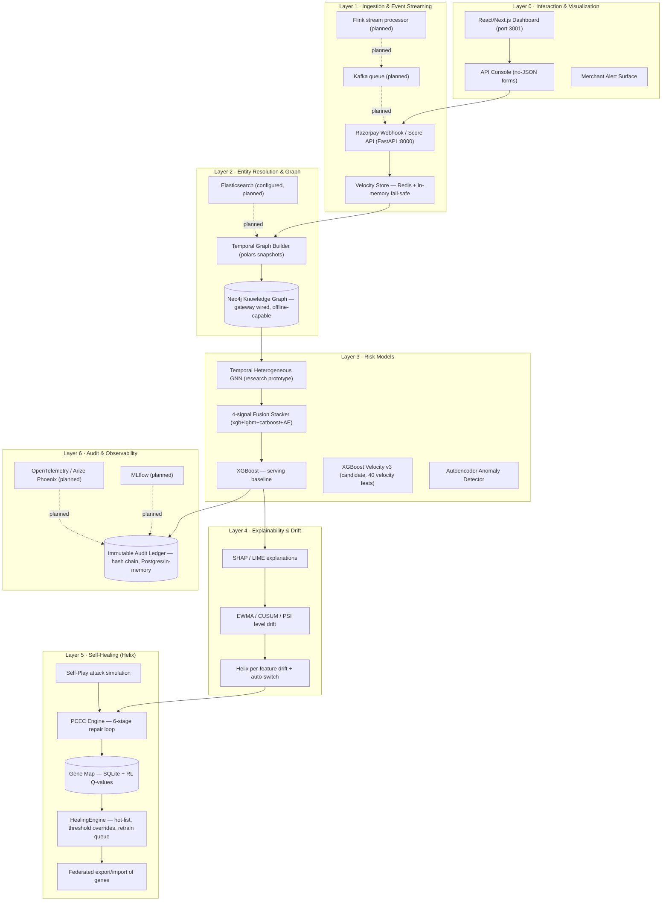
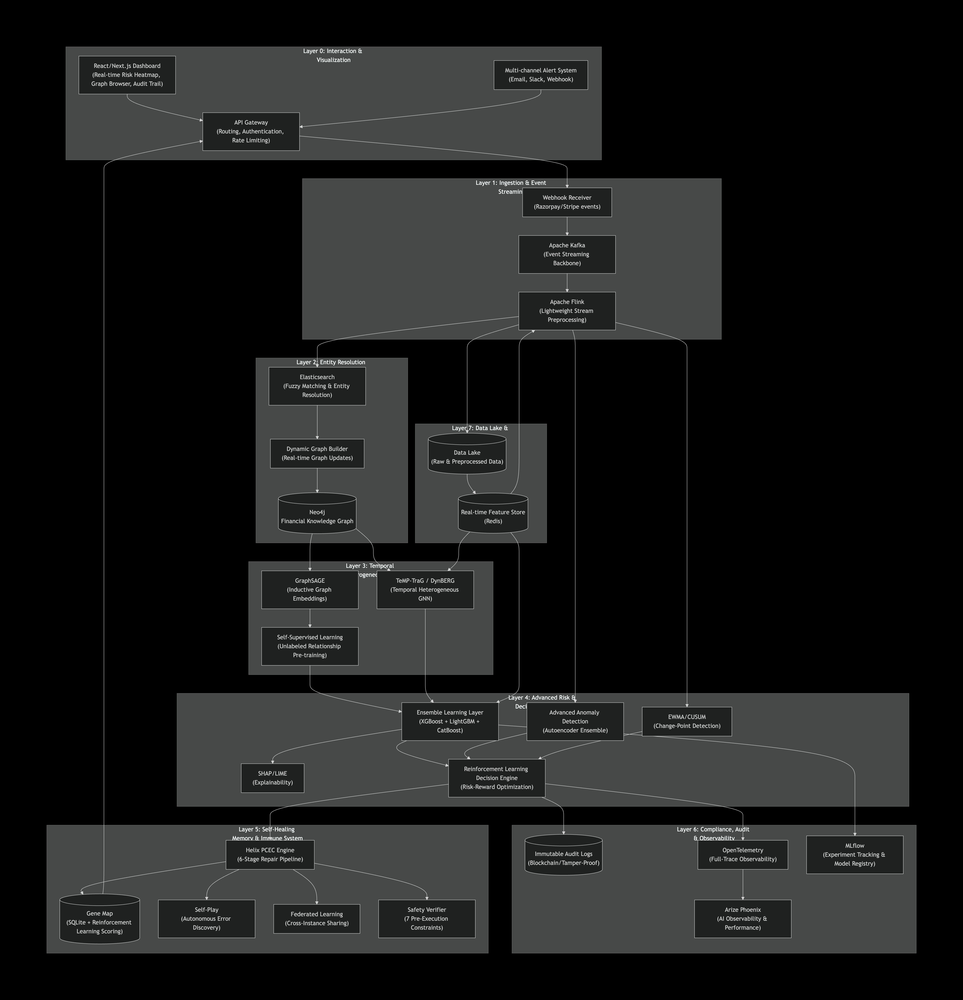
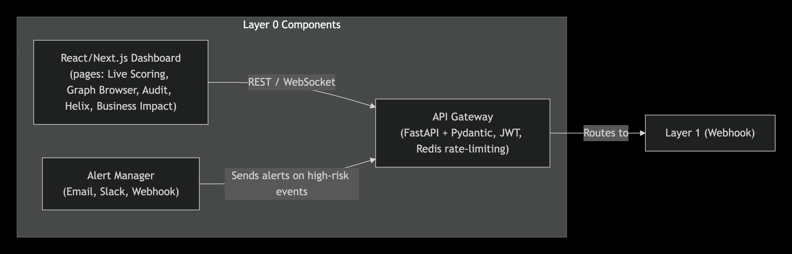
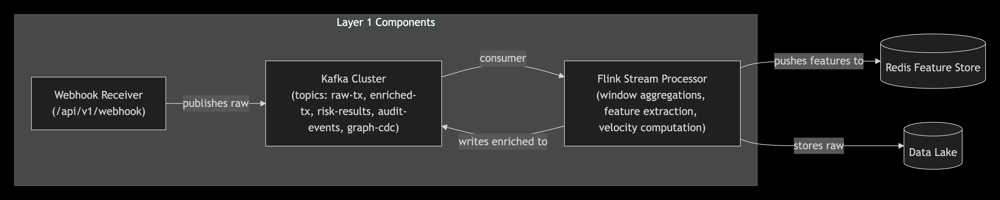
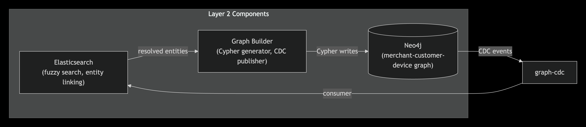
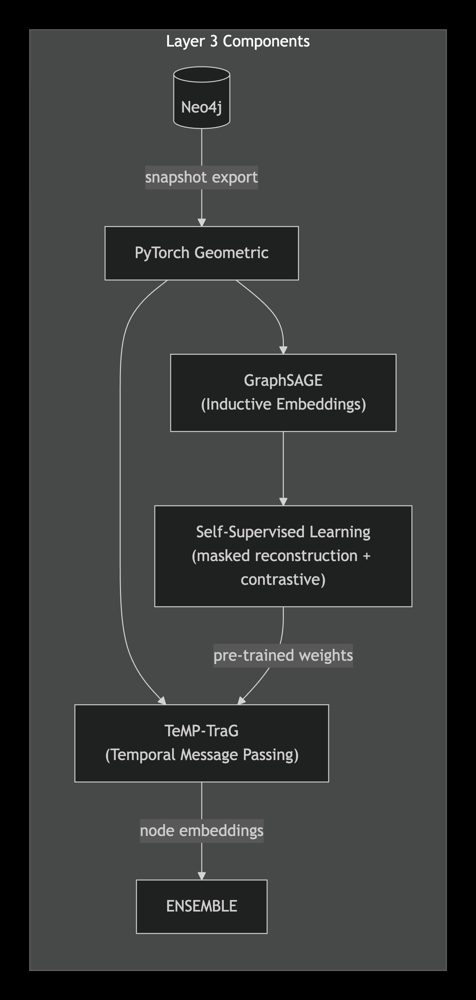
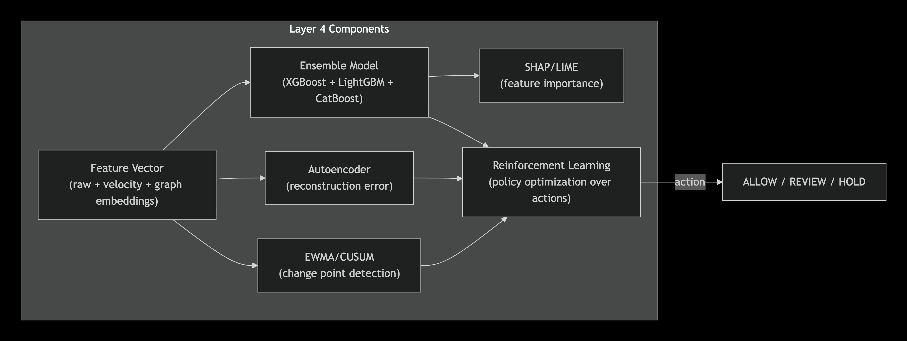
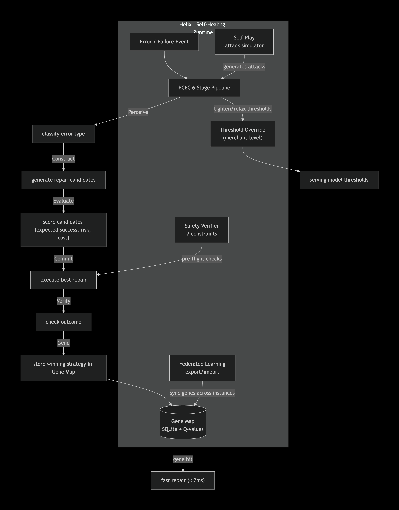
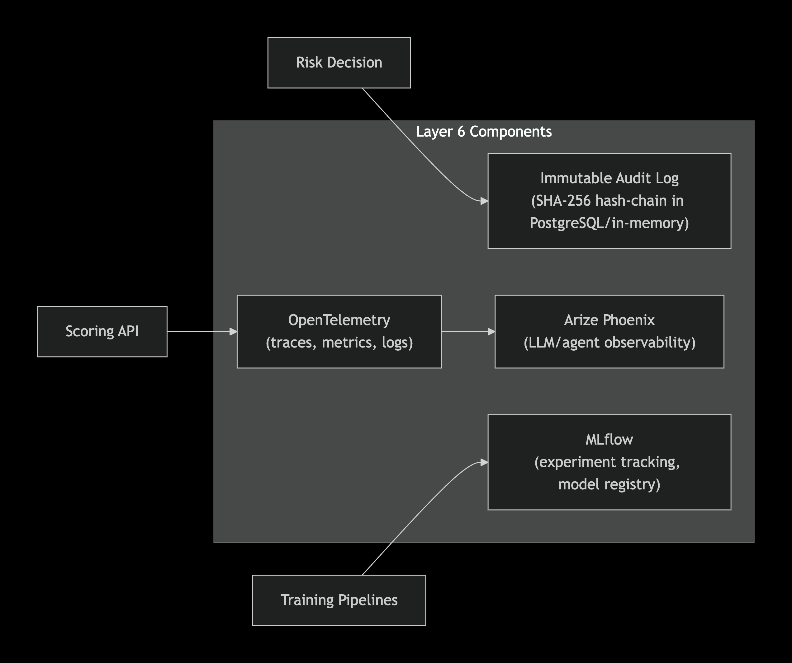
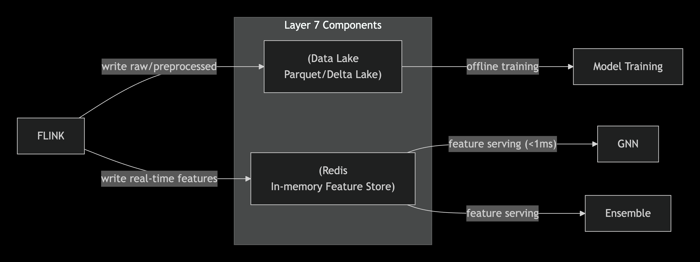

# 🛡️ Rhea FinGraph

## AI-Powered Risk Management for Payment Fraud

Rhea FinGraph is a **defense-only** merchant payment-fraud detection platform. It scores transactions in **0.466 ms** (measured steady-state core path), explains every decision with SHAP, and self-heals from failures using a **PCEC (Perceive-Construct-Evaluate-Commit-Verify-Gene)** engine backed by a persistent gene map.

> **Honesty policy:** every number in this README is measured from real runs on the IBM synthetic credit-card dataset (`data/processed/ibm_full/*.parquet`, chronological 60/20/20, leakage-safe) or from live benchmarking in this repo. Where something is a plan rather than an implementation, it is explicitly marked **planned**. Source docs: `docs/METRICS.md`, `docs/LATENCY.md`, `docs/REPAIR_PROMOTION_GATE.md`, `artifacts/business_impact.json`.

---

## 🎯 Key Metrics

| Metric | Value | Source |
|--------|-------|--------|
| **Fraud Amount Protected** | ₹3.10 Crore (96.3% by amount) | `artifacts/business_impact.json` |
| **Fraud Events Caught** | 88.6% (4,283 / 4,833 test frauds) | business_impact.json |
| **Monthly Protected** | ₹9.4 Lakhs | business_impact.json |
| **Monthly Missed (honest cost)** | ₹35.9K | business_impact.json |
| **API Latency (core scoring path)** | **0.466 ms/event** (p50 0.455) | `docs/LATENCY.md` (`scripts/latency_bench.py`) |
| **Throughput** | **2,148 events/second** | LATENCY.md |
| **Full HTTP round-trip** | ~1.5 ms/event (realistic service ceiling) | LATENCY.md |
| **Tests Passing** | **155** | `pytest tests/` |
| **Architecture Layers** | **7** (L0 interaction → L6 audit) | `docs/INTERVIEW_KB.md` |

**Latency caveat:** the 0.466 ms figure is the in-process *core* path (velocity → feature dict → XGBoost → SHAP → calibrated action → audit), measured after the Layer-0 caching fix documented in `docs/LATENCY.md`. A full FastAPI HTTP round-trip adds ~1 ms on top. Before the fix the same path cost **~140 ms/event** — the caching fix is a ~300× measured improvement, not an estimate.

---

## 🏗️ Architecture

Seven layers, one codebase. Solid boxes are **implemented and live**; dashed boxes are **planned** (honest scope).



**The pipeline in one sentence:** a payment event streams through strictly-past velocity features (L1), a cross-entity graph (L2), and a calibrated XGBoost scorer with SHAP reasons (L3/L4); drift monitors (L4) and the Helix PCEC engine (L5) close the loop — failures mutate real merchant thresholds and persist winning strategies as genes — while every decision lands in an immutable audit chain (L6).

---

## 📐 Architecture Documentation — 9 Views

The full buildathon architecture pack lives in [`architecture/`](architecture/README.md) — 9 diagrams, each with a plain-English walkthrough of components, data flow, and honest design decisions. Starting with the complete system, then the 8 sub-architectures:

### 1. Complete System Architecture
[](architecture/README.md#1-complete-system-architecture)
The 7-layer end-to-end view: a payment event enters at Layer 0 (interaction), streams through Layers 1-4 (velocity → graph → models → explainability), is monitored and self-healed by Layers 5-6 (Helix + audit), and the decision returns to the operator. **Defense-only:** the system never executes a payment — the merchant makes the final call.

### 2. Interaction & Visualization Architecture
[](architecture/README.md#2-interaction--visualization-architecture)
Layer 0 — the human interface: Next.js dashboard (18 live panels, port 3001), the no-JSON API console, and (planned) merchant alert surfaces. All data client-side fetched from FastAPI; static fallbacks keep the business-impact numbers on screen even if the API is offline.

### 3. Ingestion & Event Streaming Architecture
[](architecture/README.md#3-ingestion--event-streaming-architecture)
Layer 1 — real-time velocity intelligence: FastAPI scoring endpoint + Velocity Store (1h/24h/7d rolling windows per customer/card/merchant/device). **Strictly-past guarantee:** features are read before the event commits — a transaction never contributes to its own risk.

### 4. Entity Resolution & Graph Construction Architecture
[](architecture/README.md#4-entity-resolution--graph-construction-architecture)
Layer 2 — temporal knowledge graph: 2,000 customers, 100K+ merchants, 6,139 cards, ~24.39M PURCHASED edges, 30 monthly snapshots. Live Neo4j gateway (`/api/v1/graph/cypher`) with a whitelisted read-only query set.

### 5. Temporal Heterogeneous GNN Architecture
[](architecture/README.md#5-temporal-heterogeneous-gnn-architecture)
Layer 3's deepest signal — a TeMP-TraG-style Temporal HeteroGNN (~46K params, trained on Kaggle T4, val ROC 0.6272). Presented honestly as the next-lever research result, not the headline model.

### 6. Advanced Risk Decision Intelligence Architecture
[](architecture/README.md#6-advanced-risk-decision-intelligence-architecture)
Layer 4 — the ensemble engine: serving XGBoost (0.466 ms core path), hero Velocity V3 candidate, autoencoder, 4-signal fusion, SHAP/LIME/counterfactual explanations, and EWMA/CUSUM/PSI drift detection driving model switching.

### 7. Helix Self-Healing Architecture
[](architecture/README.md#7-helix-self-healing-architecture)
Layer 5 — the self-healing loop: 6-stage PCEC engine (Perceive → Construct → Evaluate → Commit → Verify → Gene), SQLite+RL Gene Map with Q-values, HealingEngine threshold mutations, federated export/import, self-play. Repairs change **real** merchant thresholds.

### 8. Compliance Audit Architecture
[](architecture/README.md#8-compliance-audit-architecture)
Layer 6 — tamper-evident trail: every decision hash-chained (SHA-256 of previous block), append-only, backend-agnostic (Postgres/in-memory fail-safe), verifiable end-to-end via `/api/v1/audit/verify`.

### 9. Data Lake & Feature Store Architecture
[](architecture/README.md#9-data-lake--feature-store-architecture)
The leakage-safe pipeline: raw IBM dataset (24.39M rows) → chronological parquet splits → 12-feature online / 40-feature velocity sets → graph snapshots → model artifacts. Byte-parity-verified velocity replay guarantees no row observes its own future.

> **All 9 diagrams + full docs:** [`architecture/README.md`](architecture/README.md)

---

## 🧬 Helix Self-Healing System

A complete self-healing runtime, embedded and tested — not a slide deck promise:

| Component | Status | What It Does |
|---|---|---|
| Gene Map | ✅ **Live** | SQLite knowledge base; RL Q-values (lr 0.1, +1.0/−0.5); durable across restarts |
| PCEC Engine | ✅ **Live** | 6-stage repair pipeline: Perceive → Construct → Evaluate → Commit → Verify → Gene |
| Threshold Mutation | ✅ **Live** | Repairs actually mutate the merchant's stored hold/review threshold that serving re-reads per decision |
| Federated Learning | ✅ **Live** | Export/import genes across instances; higher-Q gene wins per signature |
| Self-Play | ✅ **Live** | Autonomous attack simulation driving real PCEC repairs; survival + latency measured per run |
| Repair Promotion Gate | ✅ **Live** | Verdict `pass_with_caveat` on record — repair model ROC 0.5989 vs memory 0.5107, top-5k caught 52 vs 7 |

**Measured Helix performance** (from live demo-error runs, `docs/LATENCY.md` methodology):

| Stage | Measured latency |
|---|---|
| First failure repair (cold, no gene) | **1.9 ms** |
| Gene hit (same failure again) | **1.31 ms** |
| Self-play repair (avg over 8 attacks) | **1.33 ms** |

> All Helix latencies are measured with `time.monotonic()` in the endpoint (`latency_ms` in the response). The generic "99.9% recovery / <1 ms" marketing line for Helix runtimes is **not** claimed here — Rhea reports its own measured recovery rate from actual repairs.

---

## 📊 Model Performance

All rows from `docs/METRICS.md` / `artifacts/comprehensive_metrics.json` on the same locked test split unless noted. Rows are honest per each model's own split.

| Model | Val ROC | Test ROC | Status |
|---|---|---|---|
| **XGBoost serving** (`baseline-online-xgb`, 12 feats) | **0.8937** | 0.5967 | **Drift-detected** (val→test decay 0.89→0.60; channel-shift documented) |
| **Velocity v3** (`xgboost_velocity_v3`, 40 feats) | 0.8224 | **0.7646** | **Candidate** — drift-robust; promotion gate blocked (0.8224 < 0.8937) |
| **Helix Repair** (memory-conditioned, slice L) | in-sample | **0.5989** | `pass_with_caveat` (top-5k 52 vs 7 caught) |
| **Autoencoder** | 0.8618 | 0.4591 | Secondary signal |
| **4-signal fusion** (xgb+lgbm+catboost+AE) | 0.8190 | 0.6266 | Research (capped 300K/120K/80K) |
| **GNN** (TeMP-TraG-style, full graph) | 0.6272 | 0.4664 | Research prototype (Kaggle T4 holdout) |
| **LightGBM** (velocity, 2.5M slice) | 0.3175 | 0.7373 | **REJECTED** — val worse than random; XGBoost stays the velocity backend |

**Why v3 is not promoted (the gate working):** `make promote-velocity` requires candidate val ROC ≥ serving 0.8937; v3's 0.8224 fails the gate. Yet v3's test ROC (0.7646) crushes serving's (0.5967) with far milder val→test decay (0.822→0.765 vs 0.894→0.597): velocity features make ranking robust to the channel shift that breaks the serving model. The honest gap is partly training size (2.5M vs 14.6M rows) — a full-data v3 retrain is the next evidence step, not a promise.

---

## 🚀 Quick Start

```bash
# Clone
git clone https://github.com/aditisahu1234/Rhea-FinGraph.git
cd Rhea-FinGraph

# Python env + deps (creates .venv)
make setup

# Optional: Docker services (PostgreSQL, Redis, Neo4j, Elasticsearch)
make services-up

# Train the serving model (smoke ~20s; full data in artifacts/)
make train-baseline-smoke        # quick sanity
make train-baseline-online       # full chronological train/val/test

# Start the API (FastAPI on :8000)
make api

# Start the dashboard (new terminal — Next.js on :3001)
cd apps/dashboard
npm install
npm run dev

# Run the full test suite (155 passing)
cd ..
make test
```

Pre-trained artifacts are already committed under `artifacts/models/` (`baseline-online-xgb` is the serving model), so `make api` works out of the box.

---

## 🔧 Razorpay Demo

Defense-only end-to-end demo — create an order, pay, watch the risk decision with SHAP reasons:

```bash
# 1. Create a test order
curl -X POST localhost:8000/api/v1/razorpay/order \
  -H "Content-Type: application/json" \
  -d '{"amount_inr":"1999.00","merchant_id":"TerraMart-5311"}'

# 2. Score the payment (order_id from the response)
curl -X POST localhost:8000/api/v1/razorpay/pay \
  -H "Content-Type: application/json" \
  -d '{"order_id":"<order_id>"}'
```

**Helix demo — the self-healing loop (3 scenarios + self-play):**

```bash
# missed_fraud -> PCEC tightens the merchant's REAL hold threshold
curl -X POST "localhost:8000/api/v1/helix/demo-error?error_type=missed_fraud&merchant_id=demo_merchant_001"

# same failure again -> gene hit (measured latency_ms in the response)
curl -X POST "localhost:8000/api/v1/helix/demo-error?error_type=missed_fraud&merchant_id=demo_merchant_001"

# false_hold -> relax; cold_start -> conservative review
curl -X POST "localhost:8000/api/v1/helix/demo-error?error_type=false_hold&merchant_id=demo_merchant_002"
curl -X POST "localhost:8000/api/v1/helix/demo-error?error_type=cold_start&merchant_id=demo_merchant_003"

# self-play: 8 attacks through the real model; below-bar = missed -> repaired
curl -X POST "localhost:8000/api/v1/helix/self-play?iterations=8&reaction_ratio=4.0"

# inspect the durable gene map + measured recovery
curl -X GET localhost:8000/api/v1/helix/genes
curl -X GET localhost:8000/api/v1/helix/status
```

The dashboard (port 3001) renders all of this live: Helix Runtime panel, attack simulator, outcome P&L, graph view, and a no-JSON API Console at `/api-console`.

---

## 📈 Business Impact

Locked-test economic simulation (replays the real P&L, `artifacts/business_impact.json`):

| Outcome | Value |
|---|---|
| **Fraud amount protected** | ₹3.10 Crore (96.3% by amount) |
| **Fraud events caught** | 88.6% (4,283 / 4,833) |
| **Per-month protected** | ₹939,956.74 |
| **Per-month missed (disclosed)** | ₹35,886.00 |
| **Hold volume (defense-only cost)** | 2.34M holds — 48% of volume are legit holds; disclosed, not hidden |

The system is **defense-only**: it never executes a payment, refund, capture, or block. A model may recommend `hold`; the merchant makes the final decision.

---

## 📊 Dataset & Methodology

Primary training data: [IBM Synthetic Credit Card Transactions on Kaggle](https://www.kaggle.com/datasets/ealtman2019/credit-card-transactions) — 24.39M rows, 68 months (2014-07 → 2020-02), chronological 60/20/20 split, 4,833 test frauds (0.0991%). INR conversion at 83.5.

**Leakage safety (verified, `docs/LEAKAGE_AUDIT.md`):**

- Features are **strictly causal**: per-customer/card/merchant expanding statistics are shifted by one event — no transaction ever sees its own future.
- Label-derived priors (merchant fraud rate, MCC frequencies) are fitted on the training period only.
- Velocity features replay chronologically through production `VelocityStore` semantics; the offline twin is verified byte-parity against the serial oracle (worst abs diff 2.3e-12 on 100K rows).
- Decision bands (`allow`/`review`/`hold`) are chosen on validation precision targets, then applied unchanged to the locked test period.

---

## 🧪 Testing

```bash
# All tests: 155 passed, 0 failed
make test                      # = OMP_NUM_THREADS=1 .venv/bin/python -m pytest -q

# Targeted helix integration (closed-loop P0 tests)
.venv/bin/python -m pytest tests/test_helix_integration.py -v

# Lint
make lint                      # ruff E,F,I clean on the whole tree
```

The helix integration suite (`tests/test_helix_integration.py`) exercises the *real* wiring: PCEC tightens actual stored thresholds on missed_fraud, relaxes on false_hold, persists the fix as a gene, and round-trips export/import.

---

## 🛠️ Tech Stack

Implemented vs planned — honest columns:

| Layer | Implemented | Planned |
|---|---|---|
| API | Python 3.11, FastAPI, Pydantic | — |
| ML | XGBoost, LightGBM, CatBoost (fusion, optional), PyTorch, SHAP/LIME, Polars | Full-data v3 retrain (T4) |
| Graph | PyTorch Geometric (research), Neo4j gateway (offline-capable), polars snapshots | Elasticsearch ingestion |
| Data | Polars, PostgreSQL (audit ledger), Redis (velocity, in-memory fail-safe) | Kafka / Flink streaming |
| Frontend | Next.js 15, React, TypeScript, SVG force graph | — |
| Self-Healing | Helix (PCEC + Gene Map + federated + self-play + threshold mutation) | — |
| Observability | Immutable audit hash chain, heal/helix reports | MLflow, OpenTelemetry, Arize Phoenix |

---

## 📁 Repository Layout

```
src/fingraph_sentinel/     core package (serving, streaming, healing, helix_runtime, attack_simulator)
  helix_runtime/           PCEC engine, gene map (SQLite+RL), decorator
apps/dashboard/            Next.js dashboard (port 3001)
scripts/                   latency bench, evaluation gate, training
tests/                     155 tests (helix integration, product tier, healing, streaming, audit, …)
artifacts/models/          trained models + configs (serving + candidates)
artifacts/business_impact.json   locked-test P&L (verified)
docs/                      honest metrics, latency, gate verdicts, runbooks
```

---

## 📝 License

MIT

## 🙏 Acknowledgments

- Inspired by Razorpay Buildathon 2026
- Helix self-healing runtime concept (generic runtime claims kept separate from Rhea's measured numbers)
- Cipher Sentinel (DTCC Hackathon winner) and the Nullbyte Merchant Risk Engine (Google Cloud Hackathon 2025 3rd Place) for the defense-only merchant-risk framing
- Built with ❤️ for Razorpay AI Buildathon 2026